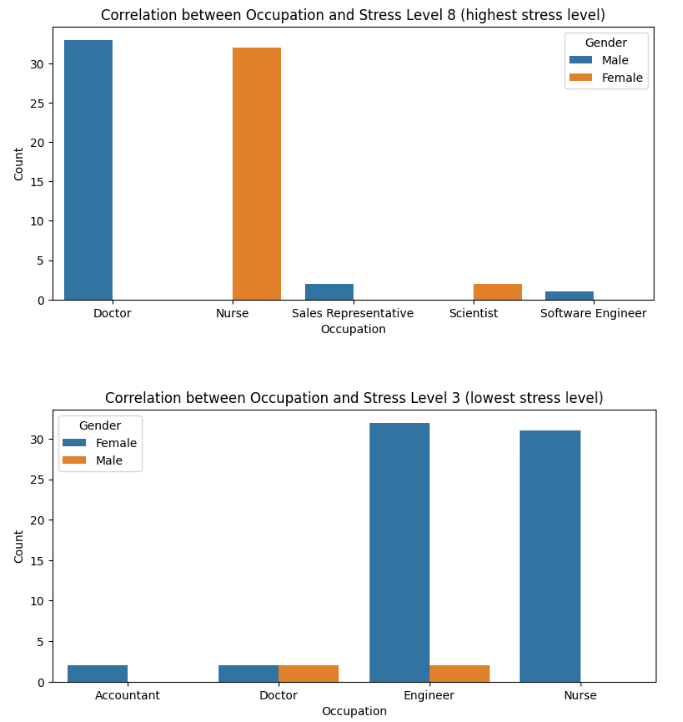
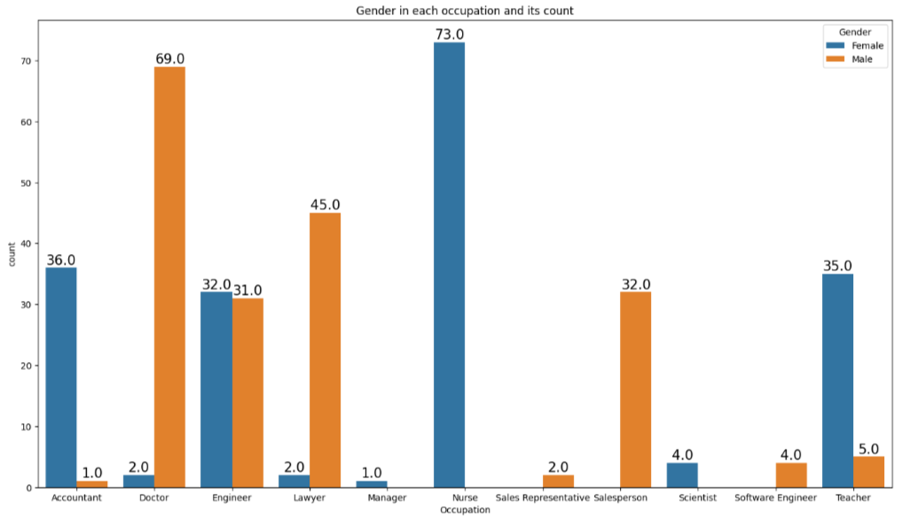
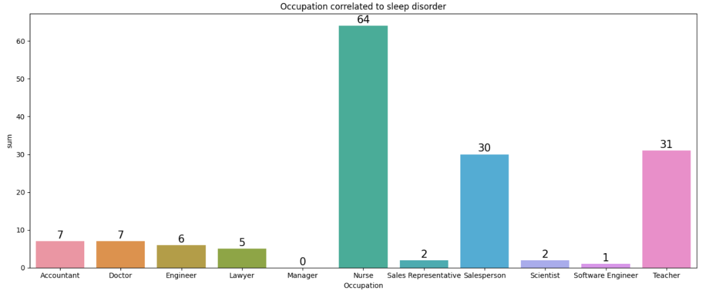
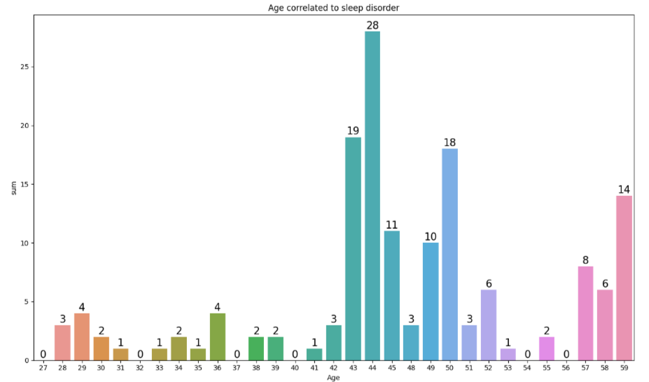
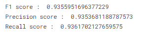
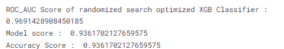
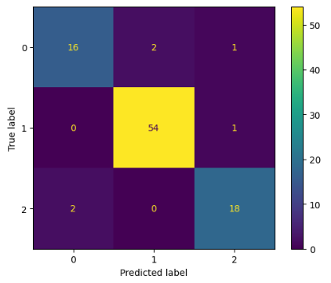

# SleepDisorderPrediction
Kaggle Notebook Source : https://www.kaggle.com/code/corneliuskarel/sleep-disorder-prediction-96-25-roc-auc-score

## Description

This project's goal is to predict the presence of sleep disorders in individuals using machine learning models. By analyzing key health-related parameters, the model assists in identifying potential sleep disorder cases, which can lead to early intervention and improved quality of life. Sleep disorders, such as insomnia and sleep apnea, affect millions globally, leading to severe health and productivity issues. However, many cases remain undiagnosed. This project aims to build a predictive model to assist healthcare providers in identifying individuals at risk, optimizing healthcare resources, and guiding timely treatment.

## Exploratory Data Analysis (EDA)
Exploratory Data Analysis to find insights from the dataset, using various visualization techniques and libraries, this component will be divided into 4 parts.

### A. Correlation between Occupation and Stress Level

This bar plot shows that stress level 8 in occupations such as Doctor, Software Engineer, Sales Representative are dominated by males. Although the Nurse and Scientist occupation with stress level 8 are dominated by females. While in stress level 3, occupations such as Accountant, Engineer, and Nurse are dominated by males. while Doctors have a more balanced diversity between males and females.

### B. Correlation between Occupation and Gender

This bar plot shows that females dominate occupations such as accountant, nurse, manager, teacher, and scientist. On the other side, males dominate occupations such as doctor, lawyer, sales representative and person, and software engineer. Occupations such as Engineer are balancely diverse with both genders not having a significant gap from each other.

### C. Correlation between Occupation and Sleep Disorder

This bar plot shows that nurses have the highest chance to suffer from sleep disorder, while sales person and teachers also have a higher chance compared to other occupations to have any form of sleep disorder.

### D. Correlation between Age and Sleep Disorder

his plot shows that people from the age of 43-50 have a higher chance to suffer from sleep disorder

## Methodologies and Tuning
- **Handle Missing Values**: Imputation techniques were applied to fill in missing values for target columns.
- **Unifying categories** : in "BMI Category" column, 'Normal Weight' and 'Normal' categories are unified, since it has the same meaning. 
- **Encoding Categorical(Ordinal & Nominal) Variables**: One-Hot Encoding for nominal features and Manually encoding the ordinal features using map function with custom dictionaries, and mean encoder for the target variable.
- **Cross Validation**: Use cross validating technique to find the best machine learning model and deciding whether it is better to use scaled or unscaled data.
- **Feature Selection** : Use correlation matrix and univariate model performance, turns out every features has atleast 60% accuracy level, every features will be used as predicting variables.
- **Hyperparameter Tuning** : Use randomized search for hyperparameter tuning and gets a better ROC AUC score. 

## Final Result 

### F1 Score, Precision, and Recall value

High Precision and Recall score indicates that our model accurately makes correct prediction for every classes

### ROC_AUC Score

### Confusion Matrix

The confusion matrix shows that the model, guesses correctly most of the times. However, there are still spaces for improvement. For example, a different hyperparameter tuning might bring better results, due to time and computing power limitation, the hyperparameter tuning method that is used in this notebook is randomized search.

### Conclusion 
- Extreme Gradient Boosting algorithm shows a realiable result, since the F1 score is above **90%**
- Hyperparameter aspect of the model can be tuned further given extra computing power and time.

### Business Recommendations
- Integrate the model into healthcare systems for early detection and intervention.
- Further optimize the model by including additional features, such as lifestyle data or environmental factors.

### Skills utilized in this project
- Data Preprocessing: Imputation, encoding, unifying variable and scaling.
- Machine Learning: Building and evaluating Classification Models such as Extreme Gradient Boosting, RandomForest, CatBoost.
- Hyperparameter Tuning: Using Randomized Search to search the best hyperparameter and apply it to the classifier.
- Data Analysis: Correlation between variables and target, to find insights on how each variable affects the prediction of a classifier.
